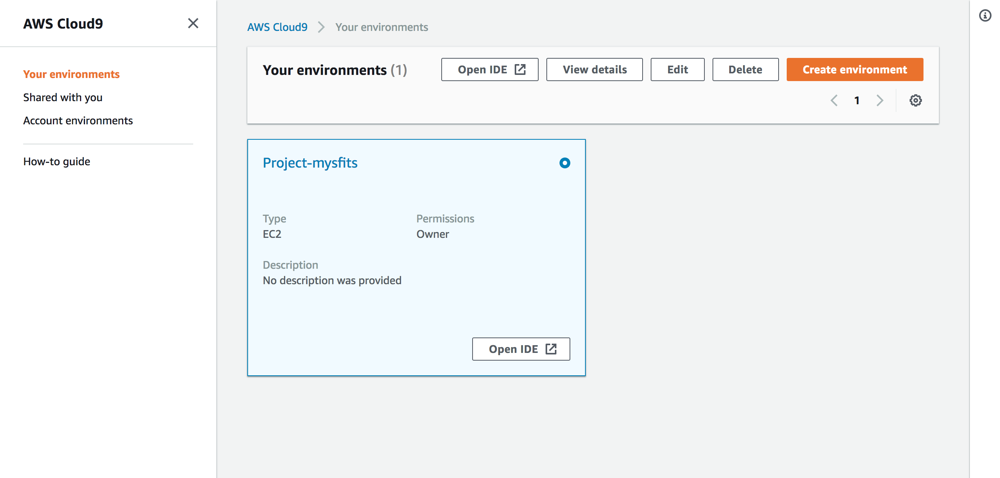
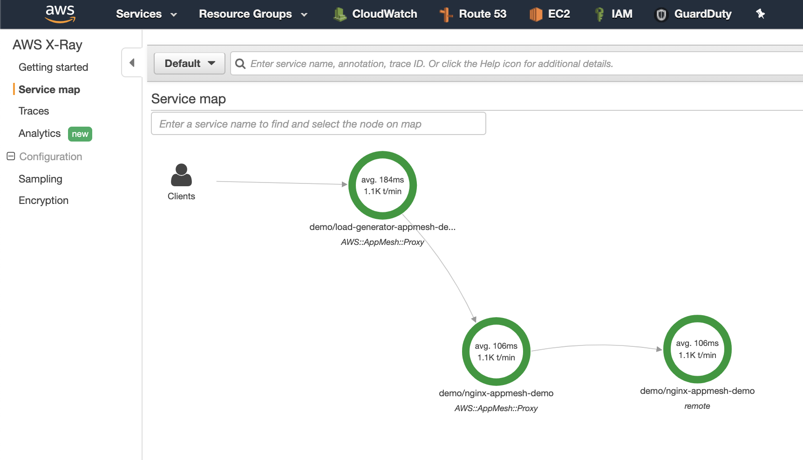
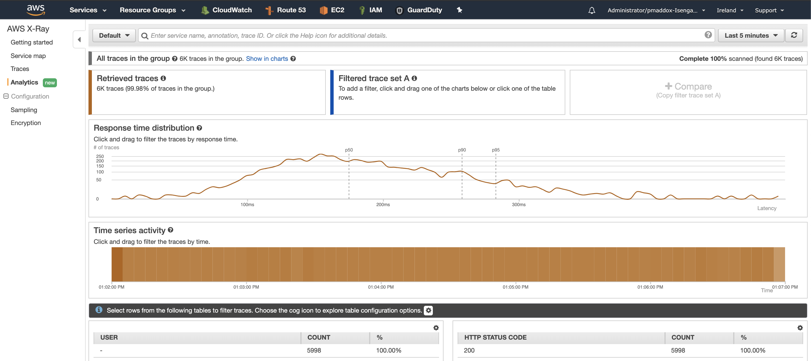
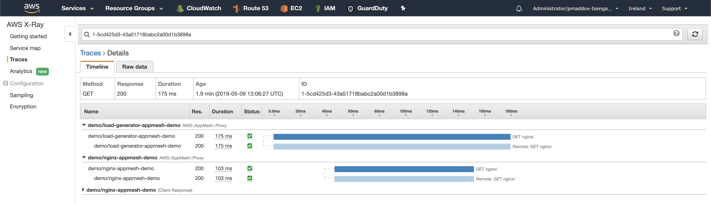

Prepare your EKS Cluster
====================================================

### Workshop Setup:

Access the AWS Cloud9 Environment created by CloudFormation:

   On the AWS Console home page, type **Cloud9** into the service search bar and select it. Find the environment named like "Project-***STACK_NAME***":

   
   
   Login to your Cloud9 environment and in a terminal window, run the following commands to install all the needed tools
   
    
      cd ~    
    
   Once you are in your home directory, run the following commans
   
      
      cd ~
      sudo yum groupinstall 'Development Tools' -y
      ruby -e "`curl -fsSL https://raw.githubusercontent.com/Linuxbrew/install/master/install`" 
      echo 'export PATH="/home/linuxbrew/.linuxbrew/bin:/home/linuxbrew/.linuxbrew/sbin/:/home/ec2-user/.nvm/versions/node/v10.16.3/bin:/home/ec2-user/.rvm/gems/ruby-2.6.3/bin:/home/ec2-user/.rvm/gems/ruby-2.6.3@global/bin:/home/ec2-user/.rvm/rubies/ruby-2.6.3/bin:/home/ec2-user/.rvm/gems/ruby-2.6.3/bin:/home/ec2-user/.rvm/gems/ruby-2.6.3@global/bin:/home/ec2-user/.rvm/rubies/ruby-2.6.3/bin:/usr/local/bin:/bin:/usr/bin:/home/ec2-user/.local/bin:/home/ec2-user/bin:/home/ec2-user/.rvm/bin:/usr/local/sbin:/usr/sbin:/sbin:/opt/aws/bin:/home/ec2-user/.local/bin:/home/ec2-user/bin:/home/ec2-user/.rvm/bin:/home/ec2-user/.local/bin:/home/ec2-user/bin"' >>~/.bashrc
      echo 'export MANPATH="/home/linuxbrew/.linuxbrew/share/man:/home/ec2-user/.nvm/versions/node/v10.16.3/share/man:/home/ec2-user/.rvm/rubies/ruby-2.6.3/share/man:/usr/local/share/man:/usr/share/man:/home/ec2-user/.rvm/man"' >>~/.bashrc
      echo 'export INFOPATH="/home/linuxbrew/.linuxbrew/share/info:"' >> ~/.bashrc
      source  ~/.bashrc
      brew tap weaveworks/tap
      brew install kubernetes-cli kubernetes-helm weaveworks/tap/eksctl
      curl -o kubectl https://amazon-eks.s3-us-west-2.amazonaws.com/1.14.6/2019-08-22/bin/darwin/amd64/kubectl
      chmod +x ./kubectl
      mkdir -p $HOME/bin && cp ./kubectl $HOME/bin/kubectl && export PATH=$HOME/bin:$PATH
      echo 'export PATH=$HOME/bin:$PATH' >> ~/.bash_profile
      kubectl version --short --client
      
      
   
  update kubeconfig and apply worker noide policy
   
     
     aws eks update-kubeconfig --name eks-workshop
     kubectl apply -f https://eks-config-louay.s3.amazonaws.com/rbac_worker_nodes.yaml 
     
   This script will install kubectl, eksctl and helm that we will need to deploy your applications in EKS
    
### Discover your EKS Cluster and install Helm

Use the eksctl to find your EKS cluster that was preprivisioned for you, run the followingh command

      eksctl get clusters
      
To learn more about eksctl, have a look at https://eksctl.io/ to learn the syntax
Now that you can see a cluster pre-provisioned for you, run the folloiowng commans to enable Helm

Setup an EKS service account for Helm (kubernetes package manager)

      kubectl apply -f https://raw.githubusercontent.com/anz-containers/aws-appmesh-helm/master/scripts/helm-rbac.yaml
      
Install Helm into the EKS cluster

      helm init --service-account=tiller
      
 Validate that the cluster deployed properly by listing the nodes
 
       kubectl get nodes
    
### Enable AppMesh in the EKS Cluster

Installing AWS App Mesh will create a namespace called appmesh-system in my cluster. Inside there will be all of the components used by App Mesh, prometheus (for monitoring), grafana (for dashboards), as well as the AWS App Mesh kubernetes controller and injector.

      helm install -n aws-appmesh --namespace appmesh-system https://github.com/anz-containers/aws-appmesh-helm/releases/latest/download/aws-appmesh.tgz
      
Let's take a look at what that's deployed, by listing all of the running pods inside the appmesh-system namespace

      kubectl get pods -n appmesh-system
      
You should see an output similar to this

      $ kubectl get pods -n appmesh-system 
      NAME                                      READY   STATUS    RESTARTS   AGE
      aws-appmesh-controller-7bcf7d87cf-gl9m8   1/1     Running   0          1m
      aws-appmesh-grafana-655c66c547-nqbhx      1/1     Running   0          1m
      aws-appmesh-inject-558fd55dc4-mn474       1/1     Running   0          1m
      aws-appmesh-prometheus-565c8bcb56-6fvhw   1/1     Running   0          1m
      
### Deploy your application
We will deploy a couple of demo microservices to the EKS cluster. It's important to note that none of these microservices have had to be modified/instrumented for App Mesh in any way.

The demo app is made up of two microservices. One that generates HTTP load (using wrk (https://github.com/wg/wrk)), and another that receives it (using nginx) .

First, let's create a new Kubernetes namespace to deploy my application in, and enable automatic sidecar injection. This will mean that all applications deployed into this namespace are automatically added into AWS App Mesh. “

      kubectl create ns appmesh-demo
      kubectl label namespace appmesh-demo appmesh.k8s.aws/sidecarInjectorWebhook=enabled

Deploy the application using Helm

      helm install -n aws-appmesh-demo --namespace appmesh-demo https://github.com/anz-containers/aws-appmesh-helm/releases/latest/download/aws-appmesh-demo.tgz

We can verify that the application deployed successfully, by listing the running pods in the appmesh-demo namespace

      $ kubectl get pods -n appmesh-demo 
      NAME                             READY   STATUS    RESTARTS   AGE
      load-generator-bb87d68fc-mr4vc   4/4     Running       1          19s
      load-generator-bb87d68fc-rmzjc   4/4     Running       1          19s
      load-generator-bb87d68fc-w6pkj   4/4     Running       1          19s
      nginx-688dd6b89-2m99c            4/4     Running       0          19s
      nginx-688dd6b89-ksdg6            4/4     Running       0          19s

“That's it! Now let's take a look at some of the deep observability that AWS App Mesh gives you. This is via native integrations with services like AWS X-Ray, prometheus, Datadog, Sysdig etc.
We'll start with Amazon X-Ray...”

### X-Ray integration
AWS X-Ray gives us a great overview of our services by default, we can see the number of transactions per second for our services, their latency, and if any services were having problems, you'd see the green ring turn amber or red depending on the severity

From your AWS console, navigate to X-Ray. You'll see it's already started collecting metrics, and drawing out a service map of microservices.

Click on the Analytics tab on the left

You can now dive deeper into your service latency profile with AWS X-Ray analytic

Click on the Traces item, you can see individual traces as they pass through your microservices. You can group them by HTTP response code, or by latency etc. This is the power of using a service mesh that can dive into the protocol (Layer 7).” 

Click on an individual trace, you can see a waterfall diagram the the request has taken, and get a clear overview of the time spent on each parts of the total request. 

You are not just limited to Amazon X-Ray. Because AWS App Mesh uses Envoy, there are other integrations available. Including open source options such as Prometheus.
When we installed AWS App Mesh into our EKS cluster, it automatically deployed preconfigured Grafana dashboards.

